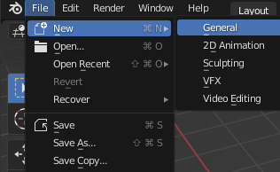

## Step title

Add an introductory sentence. What will learners achieve by the end of this step?

Image, gif or video showing what they will achieve by the end of the step. {:width="300px"}

--- task ---

Open Blender then go to the **File** menu and select **New** then **General**. 

--- /task ---

--- task ---

A **Cube** object has been created for you. The cube has an orange border to show it is the selected object.

**Change** your view to see the cube from different angles and distances. Find a view you are happy with. 

### Blender Navigation

**Tip:** To navigate Blender using a computer mouse with a middle scroll button:
+ Hold the middle-button down and drag the mouse around to rotate the view
+ Scroll the middle-button forward and backward to zoom in and out of the view

**Tip:** If you do not have a computer mouse with a middle-button you can use the navigation icons. Click in the Place the mouse over the **zoom** or **move** icons to see the cursor change to 4 arrows. Hold the left mouse button down then drag the mouse around to change the view. 

--- /task ---

--- task ---

Click on the 'Object properties' icon to open the Object properties window. 

Within the **Transform** settings, find **Scale** and change the Z axis property to `0.3`:

**Tip:** In the coordinates system used by Blender the **Z axis** points up. You might have used other software such as Unity that uses the Y axis to point up. 

--- /task ---

--- task ---

--- /task ---

--- task ---

--- /task ---

--- task ---

--- /task ---
--- save ---