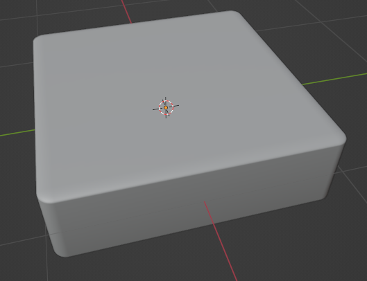
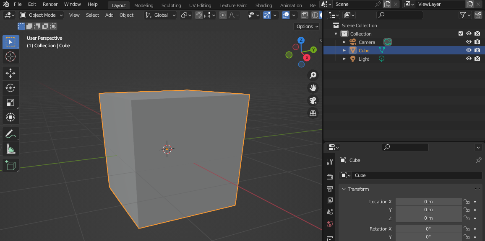
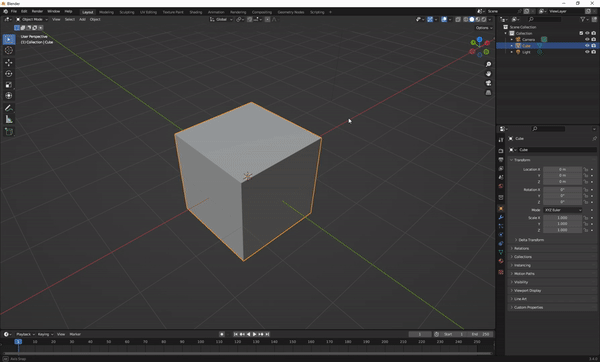
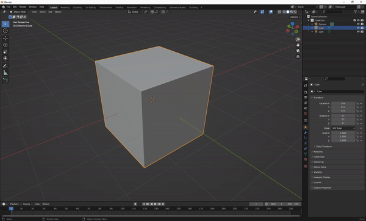
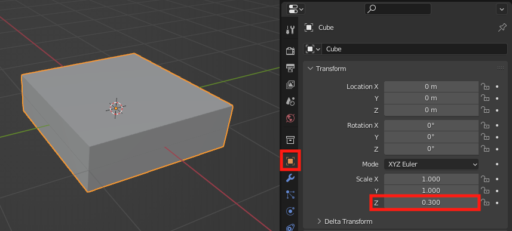
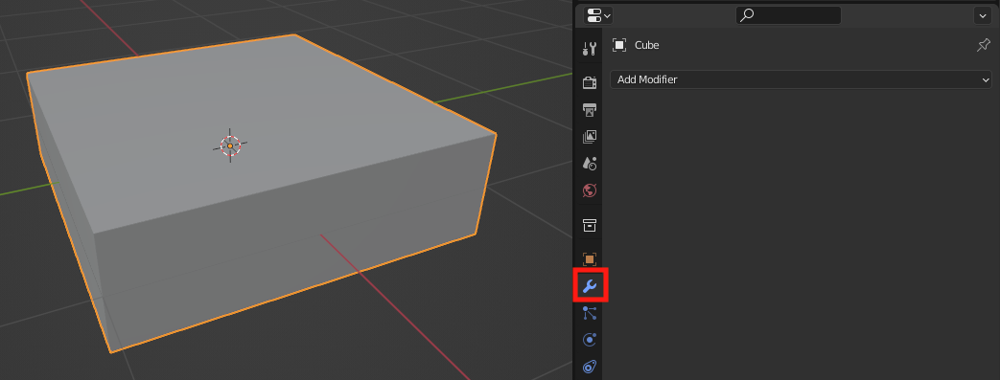
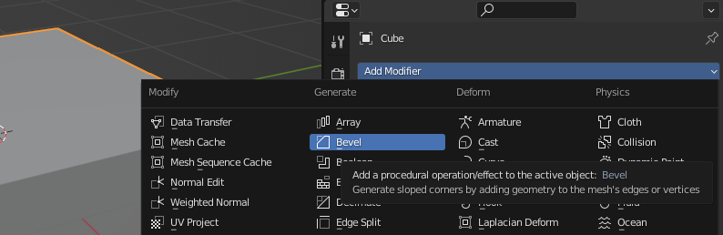
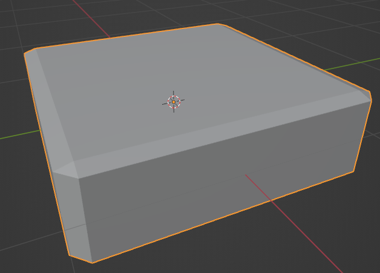
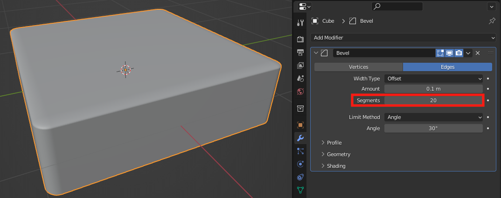
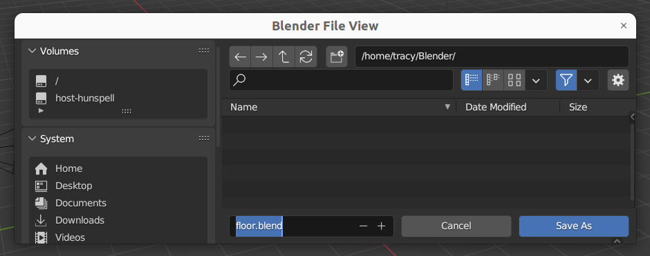

## Create your first tile

Use the **cube** object to create a single tile shape.

{:width="300px"}

--- task ---

Open Blender. Click outside the **splash screen** to close it. 

A **Cube** object has been created for you. The cube has an orange border to show it is the selected object.

--- /task ---

--- task ---

🔎 **Zoom in** to your cube so that you can see it clearly.

You can also rotate around the cube until your find a view that you are happy with.  

--- collapse ---
---
title: Changing your view in Blender
---

**Tip:** To navigate Blender using a computer mouse with a middle scroll button:
+ Hold the middle-button down and drag the mouse around to rotate the view
+ Scroll the middle-button forward and backward to zoom in and out of the view

**Tip:** If you do not have a computer mouse with a middle-button you can use the navigation icons. Place the mouse over the **zoom** or **move** icons to see the cursor change to 4 arrows. Hold the left mouse button down then drag the mouse around to change the view. 

--- /collapse ---

--- /task ---

--- task ---

Click on the 'Object properties' icon to open the Object properties pane. 

Within the **Transform** settings, find **Scale** and change the Z (up-down) axis property to `0.3`:

**Tip:** In the coordinates system used by Blender the **Z axis** points up. You might have used other software such as Unity that uses the Y axis to point up. 

--- /task ---

--- task ---

Click on the 'Modifier properties' icon to open the Modifier properties pane. 

--- /task ---

--- task ---

Click on the 'Add modifier' dropdown then choose **Bevel**. 

**Notice:** The edges of the cube now have a bevel effect.

--- /task ---

--- task ---

Change the number of segments to `20`. This gives a smoother edge. 

--- /task ---

--- task ---

Click on the Bevel dropdown arrow and select **Apply**. 

**Notice:** The bevel modifier has now disapeared from the Modifier pane.

--- /task ---

--- task ---

Right-click on the 3D cube model then select **Shade Smooth** to give your segments a smoothed out appearance. 

--- /task ---

--- task ---

**Save** your project using 'File' -> 'Save As'. Name your file 'floor.blend'. 

**Tip:** You can reopen a saved Blender project using 'File' -> 'Open'. 

--- /task ---