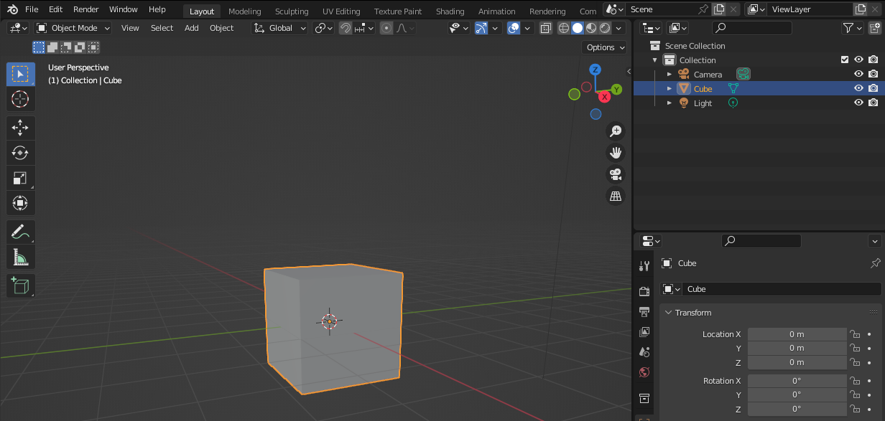

## Create your first tile

In Blender, you can create 3D objects such as cubes. Cubes can be edited to create objects including dice, boxes, and tiles.

{:width="300px"}

--- task ---

Open Blender. Click outside the **splash screen** to close it:

A new Blender project always includes a **Cube** object. The cube has an orange outline to show it is the selected object:

--- /task ---

--- task ---

🔎 **Zoom in** and 🔄 **rotate** your view to see the cube clearly:

--- collapse ---
---
title: Use a mouse with a scroll wheel to zoom and rotate 
---

To navigate Blender using a computer mouse with a scroll wheel:
+ Press and hold the scroll wheel down and drag the mouse around to rotate the view
+ Use the scroll wheel to scroll forward and backward to zoom in and out of the view

--- /collapse ---

--- collapse ---
---
title: Use a mouse without a scroll wheel to zoom and rotate
---

If you do not have a computer mouse with a scroll wheel, you can use the navigation icons. 

Place the mouse over the **Zoom** or **Move** icon and the cursor will change to four arrows. 

Click and hold with the left mouse button and drag the mouse around to change the view.

To rotate the view, click and hold on the **Orbit** icon and drag the mouse around.

--- /collapse ---

--- /task ---

--- task ---

Click on the **Object Properties** icon to open the Object Properties tab.

Go to the **Transform** settings and find **Scale**. Change the **Z** (up–down) axis property to `0.3`:

**Tip:** In the coordinate system used by Blender, the **z-axis** points up. You might have used another coordinate system; for example, in some software, such as Unity, the y-axis points up.

--- /task ---

### Add sloped edges with a Bevel modifier

--- task ---

Click on the **Modifier Properties** icon to open the Modifier Properties tab:

**Tip:** The icons in Blender are very small. Hold your mouse cursor over them to see a tool tip with the name of the tool.

--- /task ---

--- task ---

Click on the **Add Modifier** drop-down menu, then choose **Bevel**:

**Notice:** 👀 The edges of the cube are now sloped:

--- /task ---

### Create smoother sloped edges

--- task ---

Change the number of **Segments** to `20`. This gives a smoother sloped edge:

--- /task ---

--- task ---

Click on the **Bevel** drop-down menu arrow, then select **Apply**:

**Notice:** 👀 The Bevel modifier has now disappeared from the Modifier Properties tab.

--- /task ---

--- task ---

Right-click on the 3D cube model, then select **Shade Smooth** to give your segments a smoother appearance: 

**Debug:** If you do not see the **Shade Smooth** menu option, make sure you are in **Object Mode**: 

--- /task ---

--- task ---

**Save** your project. Click on **File** > **Save As...**. Name your file `floor.blend`:

**Tip:** To reopen a saved Blender project, you can click on **File** > **Open**.

--- /task ---