## Make a tiled floor

Use your single tile to create an 8 by 8 tiled floor.

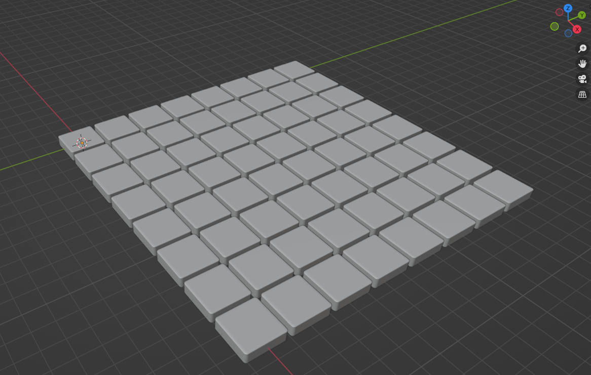{:width="300px"}

### Create one row of 8 tiles

An **array modifier** creates copies of an object that can be offset to create a pattern of repetative objects. An Architect could use an array modifier to create a spiral staircase for a home from just one step. Or when designing a model for an office building they could copy a tree to place them along a path.

--- task ---

Click on the ‘Add modifier’ dropdown then choose **Array**:

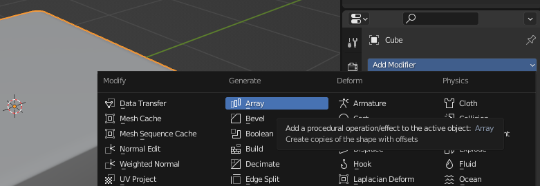

The Array modifier automatically creates a second tile.

**Tip:** you might need to zoom out to see both tiles:

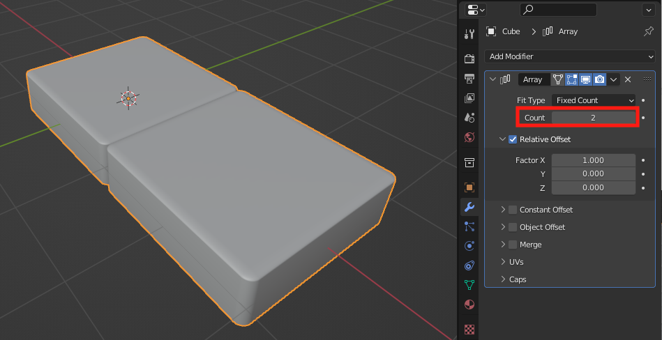

--- /task ---

Change the value in the **Count** property to `8`. 

This creates a row of 8 tiles side by side:

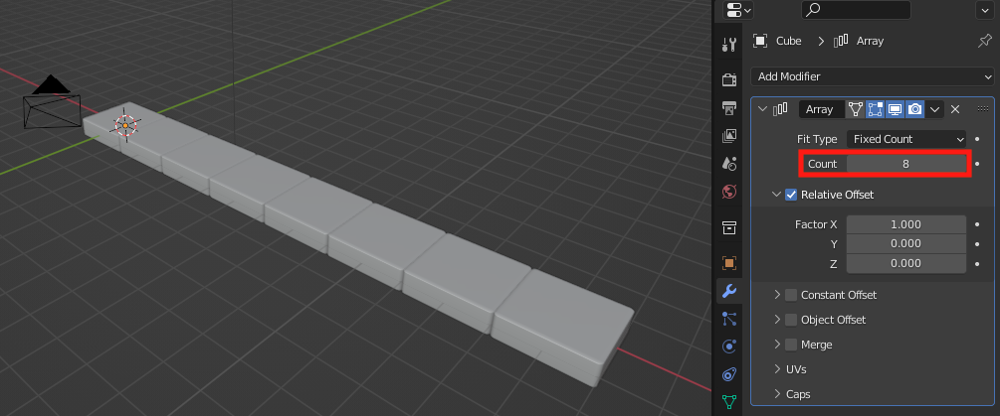

--- task ---

The tiles are offset by `1.000` this means they are next to each other with no gap. 

Change the value in the **Factor X** property to `1.100` to increase the offest distance and create a small gap between tiles:

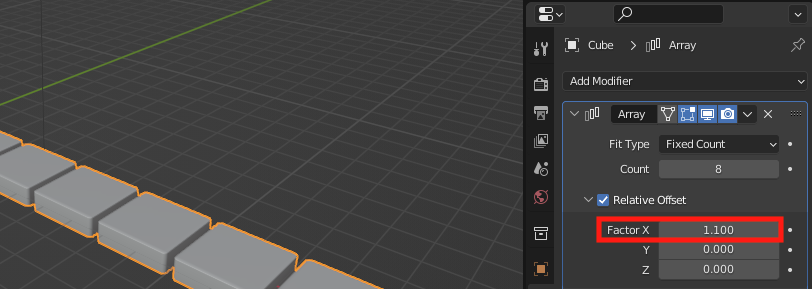

--- /task ---

--- task ---

Click on the Array dropdown arrow and select **Apply**: 

--- /task ---

### Create 8 rows of 8 tiles

--- task ---

Click on the ‘Add modifier’ dropdown then choose **Array** to create a second array modifier:

The Array modifier automatically creates a second row of 8 tiles that are also offset on the X axis.

**Tip:** you can see where the second row starts because it has an offset of `1.000` so there is no gap:

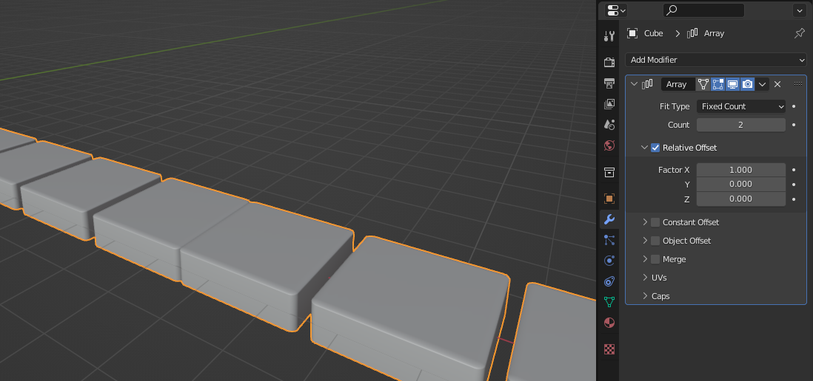

--- /task ---

--- task ---

To create an 8 by 8 grid of tiles, the offset needs to be on the **Y axis**. 

Change the value in the **Factor X** property to `0.000` and the **Factor Y** value to `1.100`:

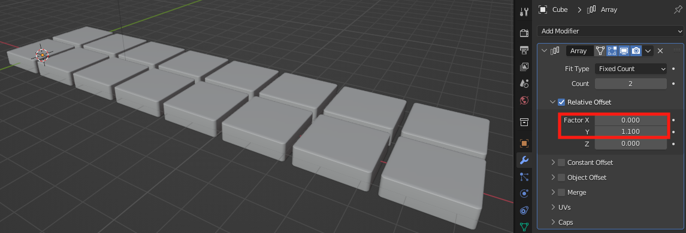

--- /task ---

--- task ---

Change the value in the **Count** property to `8`. 

This creates 8 row of 8 tiles:

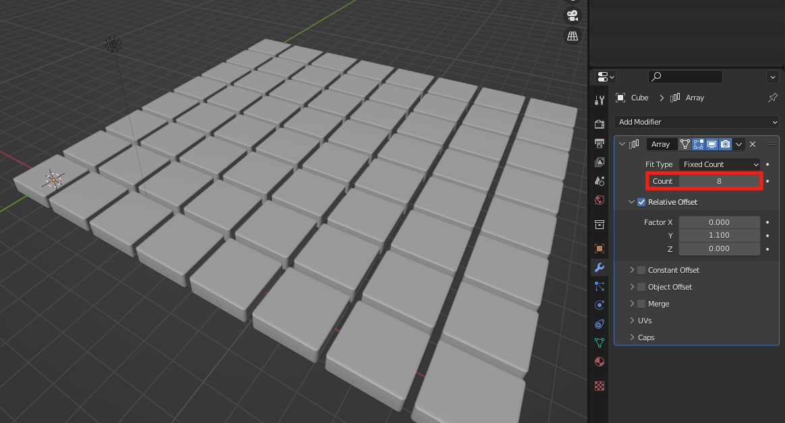

--- /task ---

--- task ---

Click on the Array dropdown arrow and select **Apply**: 

--- /task ---

### Seperate the grid into 64 seperate tile objects

--- task ---

Click on the mode dropdown menu and select **Edit Mode**:

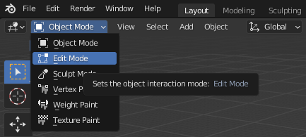

--- /task ---

--- task ---

Right-click on the highlighted tiles and select 'Separate' --> 'By Loose Parts':

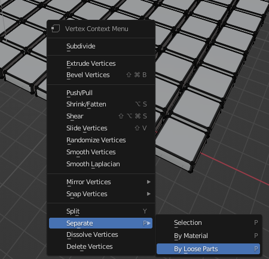

There are now 64 individual tiles each shown as a Cub object in the Scene Collection:

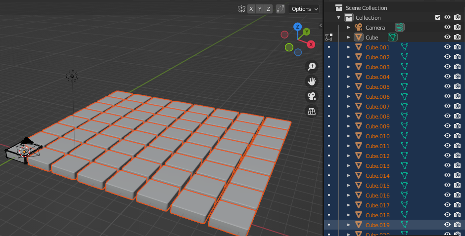

--- /task ---

--- save ---