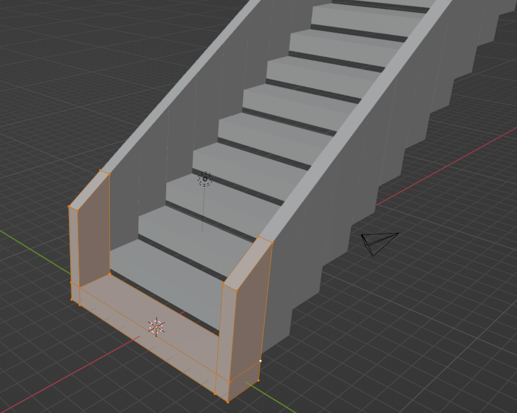

## Make a tiled floor

In Blender, you can quickly create multiple copies of an object and place them in a pattern.

{:width="300px"}

### Create one row of eight tiles

An **Array modifier** creates copies of an object that can be placed at a distance from each other to create a pattern of repeating objects. An architect could use an Array modifier to create a staircase for a home from just one step. When designing a model for an office building, the architect could use an Array modifier to place trees along a path.

{:width="300px"}

--- task ---

Click on the **Add Modifier** drop-down menu, then choose **Array**:

The Array modifier automatically creates a second tile.

**Tip:** You might need to zoom out to see both tiles:

--- /task ---

--- task ---

Change the value in the **Count** property to `8`.

This creates a row of eight tiles side by side:

--- /task ---

--- task ---

The tiles are offset by 1.000. This means they are placed next to each other with no gap.

Change the value in the **Factor X** property to `1.100` to increase the offset and create a small gap between the tiles:

--- /task ---

--- task ---

Click on the **Array** drop-down menu arrow, then select **Apply**: 

--- /task ---

### Create eight rows of eight tiles

--- task ---

Click on the **Add Modifier** drop-down menu, then choose **Array** to create a second Array modifier:

The Array modifier automatically creates a second row of eight tiles that are also offset on the x-axis.

**Tip:** You can see where the second row starts because it has an offset of 1.000, so there is no gap:

--- /task ---

--- task ---

To create an 8-by-8 grid of tiles, the offset placements need to be along the **y-axis**.

Change the value in the **Factor X** property to `0.000`. Change the value in the **Factor Y** property to `1.100`:

--- /task ---

--- task ---

Change the value in the **Count** property to `8`.

This creates eight rows of eight tiles:

--- /task ---

--- task ---

Click on the **Array** drop-down menu arrow, then select **Apply**:

--- /task ---

--- save ---