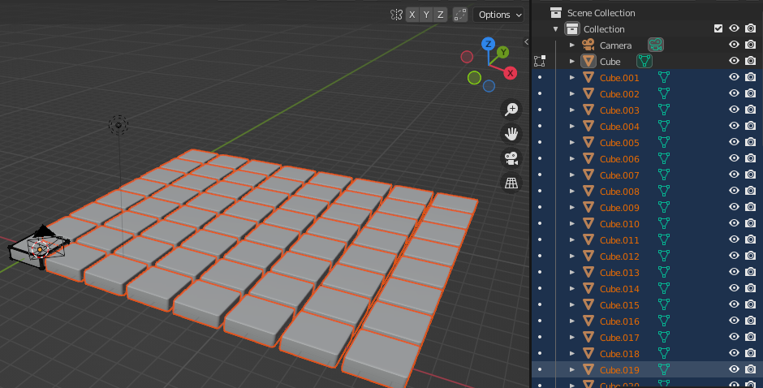

## Set the centre point

Move the origin point so that it is at the center of your tile floor.

{:width="300px"}

### Centre the origin point

The origin point is set to the centre of your original tile. The X and Y axis lines will meet in this point:

--- task ---

Go to the **Scene Collection** pane and click on the 'Cube' object:

--- /task ---

--- task ---

Go to Object -> Set Origin -> Geometry of origin.

The origin marker will move to the centre and the X and Y axis lines will meet in this point:

--- /task ---

### Separate the grid into 64 separate tile objects

--- task ---

Click on the mode dropdown menu and select 'Edit Mode':

--- /task ---

--- task ---

Right-click on the highlighted tiles and select 'Separate' -> 'By Loose Parts':

There are now 64 individual tiles each shown as a Cube object in the Scene Collection:

--- /task ---