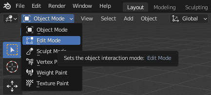

## Set the centre point

In Blender, objects move around an origin point. You can move the origin point of an object.

{:width="300px"}

### Move the origin point to the centre of your floor

The origin point is set to the centre of your original cube tile. The x- and y-axis lines meet at this point:

--- task ---

Go to the Scene Collection pane and click on the **Cube** object:

--- /task ---

--- task ---

Go to the **Object** menu and select **Set Origin** > **Geometry to Origin**.

The origin point marker will move to the centre of the tiled floor, and the x- and y-axis lines will meet at this point:

--- /task ---

### Separate the grid into 64 separate tile objects

The 8-by-8 grid of tiles is still one object. This object can be separated into 64 independent tile objects.

--- task ---

Click on the **Mode** drop-down menu and select **Edit Mode**:

--- /task ---

--- task ---

Right-click on the highlighted tiles and select **Separate** > **By Loose Parts**:

There are now 64 individual tiles each shown as a Cube object in the Scene Collection pane:

--- /task ---
