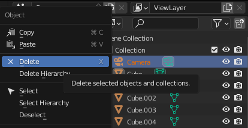
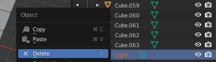
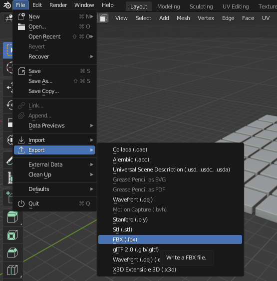

### Use your tiled floor in Unity

The tiled floor from this **Blender - Create a 3D tiled floor** project can be exported and used in our [More Unity](https://projects.raspberrypi.org/en/pathways/more-unity) path. 

<mark>Embed webGL of 3rd Explore project with the tiled floor</mark>

### Use Blender to export your tiled floor

--- task ---

Unity projects already have a camera. In Blender, go to the **Scene Collection** pane and right-click on the 🎥 Camera then select **Delete**: 

--- /task ---

--- task ---

Unity projects already have a light source. In Blender, scroll to the bottom of the list of objects in the **Scene Collection** and right-click on the 💡 Light then select **Delete**:

--- /task ---

--- task ---

Go to 'File' -> 'Export' -> 'FBX'. Give your tiled floor a sensible name then click 'Export FBX.:

--- /task ---

### Import your tiled floor into Unity

--- task ---

Open your Unity project and from the 'Assets' menu select **Import New Asset...**. Find your tiled floor and Import it. 

Your tiled floor will appear in the Project window. You can drag it to the 'Hierarchy' or 'Scene View' to use it in your Unity project:

**Tip:** A parent GameObject has been created using the name you used when saving your floor. Each of the 64 cubes are stored as individual child GameObjects. 

--- /task ---