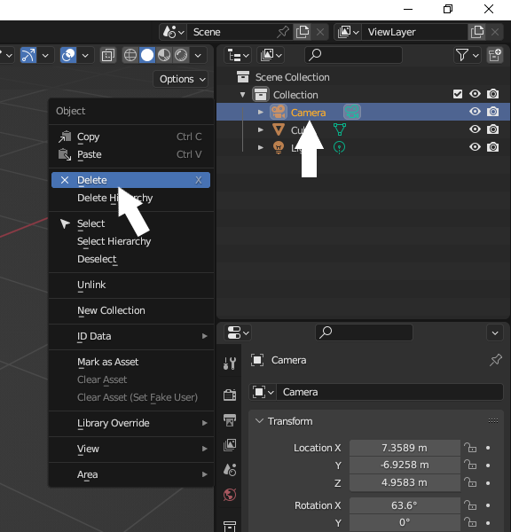

## What next?

A tiled floor lIf you are following the [PathName](https://projects.raspberrypi.org/en/raspberrypi/more-unity) path, you can move on to the [ProjectName](https://projects.raspberrypi.org/en/projects/project-name) project. In this project, you will make a (add description here).

--- print-only ---

--- /print-only ---

--- no-print ---

  <iframe allowtransparency="true" width="485" height="402" src="https://scratch.mit.edu/projects/embed/486719199/?autostart=false" frameborder="0"></iframe>

--- /no-print ---

If you want to have more fun exploring Scratch, then you could try out any of [these projects](https://projects.raspberrypi.org/en/projects?software%5B%5D=scratch&curriculum%5B%5D=%201).

### TO BECOME AN EXPORT FOR UNITY INGREDIENT

--- task ---

Go to the **Scene Collection** pane and click on the 🎥 Camera layer so that it is selected. Right-click with your mouse or trackpad and select **Delete**. 

--- /task ---

--- task ---

Staying in the **Scene Collection** pane, click on the 💡 Light layer to select it. Right-click and select **Delete**.

--- /task ---