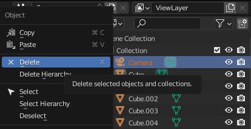
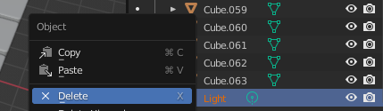
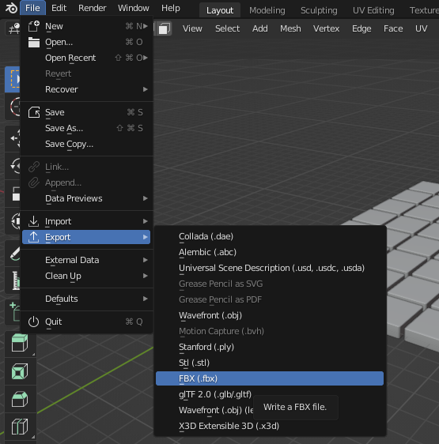

### Use your tiled floor in Unity

The tiled floor from this **Blender: Create a 3D tiled floor** project can be exported and used in our [More Unity](https://projects.raspberrypi.org/en/pathways/more-unity) path.

--- no-print ---

Control the movement of player one using <kbd>WASD</kbd> (or <kbd>ZQSD</kbd>). Player Two is controlled using the arrow keys. Try to find the safe route across the tiles before the other player!  

<iframe allowtransparency="true" width="710" height="500" scrolling = "no" src="https://raspberrypilearning.github.io/unity-webgl/DontFallThrough" frameborder="0"></iframe>

--- /no-print ---

### Use Blender to export your tiled floor

--- task ---

Unity projects already have a camera. In Blender, go to the Scene Collection pane and right-click on the 🎥 **Camera**, then select **Delete**: 

--- /task ---

--- task ---

Unity projects already have a light source. In Blender, scroll to the bottom of the list of objects in the Scene Collection pane and right-click on the 💡 **Light**, then select **Delete**:

--- /task ---

--- task ---

Go to **File** > **Export** > **FBX**. Give your tiled floor a sensible name, then click on **Export FBX**:

--- /task ---

### Import your tiled floor into Unity

--- task ---

Open your Unity project. In the **Assets** menu, select **Import New Asset...**. Find your tiled floor and import it.

Your tiled floor will appear in the Project window. You can drag it to the Hierarchy window or the Scene view to use it in your Unity project:

**Tip:** A parent GameObject has been created using the name you used when you saved your floor. Each of the 64 cubes are stored as individual child GameObjects.

--- /task ---