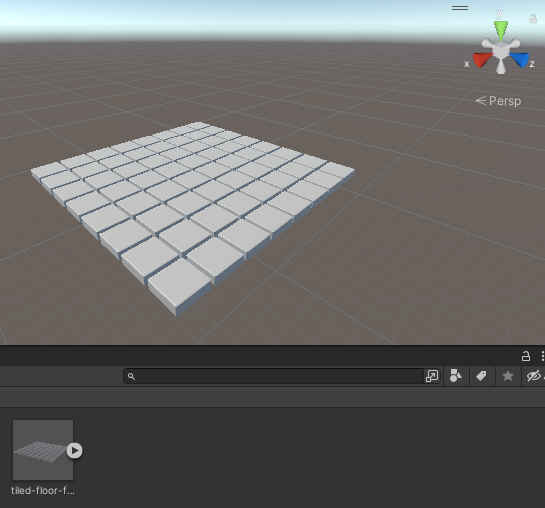

## What next?

### Blender animation path

Our [Blender basics](https://projects.raspberrypi.org/en/pathways/blender-basics) path covers how to create, animate and render 3D objects and scenes to make a Snow scene animation:

<video width="560" height="315" controls>
<source src="resources/snow-scene-rendered.mkv" type="video/mp4">
Your browser does not support WebM video, try FireFox or Chrome
</video>

**Tip:** In this path you will create a snowman, trees, a car, a house, and a rocket. Think about how you could use Array modifiers to create a row of houses or a car park full of cars. 

### More Unity path

The tiled floor from this **Blender - Create a 3D tiled floor** project and the material from the [Blender - Add material effects to a marble](https://projects.raspberrypi.org/en/projects/blender-marble) project can be exported and used in our [More Unity](https://projects.raspberrypi.org/en/pathways/more-unity) path. 

<mark>Embed webGL of 3rd Explore project with the tiled floor</mark>

**Tip:** If you have not used Unity before you can start with our [Introduction to Unity](https://projects.raspberrypi.org/en/pathways/unity-intro) path to make 3D worlds with quests and games.

### Export your tiled floor for use in Unity projects

--- task ---

Unity projects already have a camera. Go to the **Scene Collection** pane and right-click on the 🎥 Camera then select **Delete**: 

--- /task ---

--- task ---

Unity projects already have a light source. Scroll to the bottom of the list of objects in the **Scene Collection** and right-click on the 💡 Light then select **Delete**:

--- /task ---

--- task ---

Go to 'File' --> 'Export' --> 'FBX'. Give your tiled floor a sensible name then click 'Export FBX.:

--- /task ---

--- task ---

Open your Unity project and from the 'Assets' menu select **Import New Asset...**. Find your tiled floor and Import it. 

Your tiled floor will appear in the Project window. You can drag it to the 'Hierarchy' or 'Scene View' to use it in your Unity project:

**Tip:** A parent GameObject has been created using the name you used when saving your floor. Each of the 64 cubes are stored as individual child GameObjects. 

--- /task ---